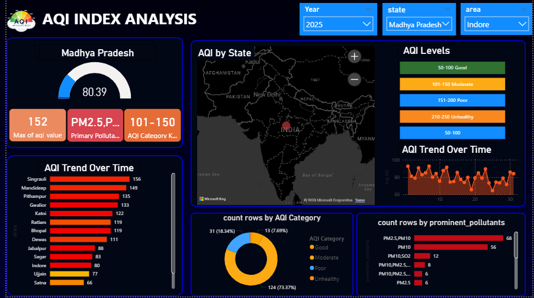

# 🌫️ Air Quality Index (AQI) Analysis Dashboard


An interactive Power BI dashboard analyzing Air Quality Index (AQI) data across cities in India — uncovering pollution trends, dominant pollutants, and environmental health patterns.

---

## 📸 Dashboard Preview



> *Dashboard filtered for Madhya Pradesh, 2025 — showing city-level AQI rankings, pollutant breakdown, and category distribution.*

---

## 📌 Project Overview

Air pollution is one of the most pressing environmental challenges. This project transforms raw AQI measurement data into an interactive, filterable dashboard that enables quick identification of high-risk cities, seasonal trends, and pollutant contributions — supporting data-driven environmental decision-making.

---

## 🎯 Objectives

- Visualize AQI trends across cities and time periods
- Identify cities with critically high pollution levels
- Break down the contribution of individual pollutants to overall AQI
- Provide a filterable interface for state-level and year-level analysis
- Classify air quality into actionable categories (Good → Unhealthy)

---

## 📂 Dataset

| Feature | Description |
|---|---|
| `City` | Location where air quality was measured |
| `Date` | Date of AQI measurement |
| `AQI Value` | Composite air quality index score |
| `AQI Category` | Good / Moderate / Poor / Unhealthy |
| `PM2.5` | Fine particulate matter (≤ 2.5 µm) |
| `PM10` | Coarse particulate matter (≤ 10 µm) |
| `NO₂` | Nitrogen dioxide concentration |
| `SO₂` | Sulfur dioxide concentration |
| `CO` | Carbon monoxide level |
| `O₃` | Ground-level ozone |

---

## 🛠️ Tools & Technologies

| Tool | Purpose |
|---|---|
| **Power BI Desktop** | Dashboard creation and visualization |
| **Power Query** | Data cleaning and transformation |
| **DAX** | Custom measures and calculated columns |
| **Bing Maps (built-in)** | Geographic AQI mapping by state |

---

## 📊 Dashboard Features

- **KPI Cards** — Max AQI value, primary pollutant, and AQI category at a glance
- **Gauge Chart** — Average AQI score with visual threshold indicators
- **AQI Trend Over Time** — Line chart tracking pollution fluctuations across dates
- **City-Level Bar Chart** — Ranked comparison of AQI values across cities
- **Geographic Map** — State-level AQI distribution across India
- **Donut Chart** — AQI category distribution (Good / Moderate / Poor / Unhealthy)
- **Pollutant Breakdown** — Count of rows by prominent pollutant type
- **Interactive Slicers** — Filter by Year, State, and Area

---

## 💡 Key Insights

- **Singrauli** recorded the highest AQI (156) among all cities in Madhya Pradesh, classified as *Moderate to Poor*
- **PM2.5 and PM10** are the dominant pollutants, appearing together in 68 recorded instances
- **73.37%** of all AQI readings fall in the *Unhealthy* category, indicating a systemic air quality concern
- Cities like **Indore (80)** and **Sagar (83)** show relatively better air quality compared to industrial zones
- AQI trends over time show cyclical spikes, likely corresponding to seasonal and industrial activity patterns

---

## 📁 Repository Structure

```
📦 aqi-analysis-dashboard
 ┣ 📊 AQI_Dashboard.pbix        # Power BI dashboard file
 ┣ 📄 aqi_data.csv              # Raw dataset
 ┣ 🖼️ Screenshot__43_.png       # Dashboard preview image
 ┗ 📝 README.md
```

---

## 🚀 Getting Started

1. **Clone the repository**
   ```bash
   git clone https://github.com/your-username/aqi-analysis-dashboard.git
   ```

2. **Open the dashboard**
   - Install [Power BI Desktop](https://powerbi.microsoft.com/desktop/) (free)
   - Open `AQI_Dashboard.pbix`

3. **Explore the data**
   - Use the **Year**, **State**, and **Area** slicers to filter views
   - Hover over charts for detailed tooltips
   - Click any visual to cross-filter the entire dashboard

---

## 📈 AQI Category Reference

| AQI Range | Category | Color |
|---|---|---|
| 0 – 50 | Good | 🟢 Green |
| 51 – 100 | Satisfactory | 🟡 Yellow |
| 101 – 150 | Moderate | 🟠 Orange |
| 151 – 200 | Poor | 🔴 Red |
| 201 – 300 | Very Poor | 🟣 Purple |
| 300+ | Severe | ⚫ Maroon |

---

## 🤝 Contributing

Contributions, issues, and feature requests are welcome! Feel free to open a [GitHub Issue](https://github.com/your-username/aqi-analysis-dashboard/issues) or submit a pull request.

---

> *"Data is the new clean air — let's use it to protect the real thing."*
